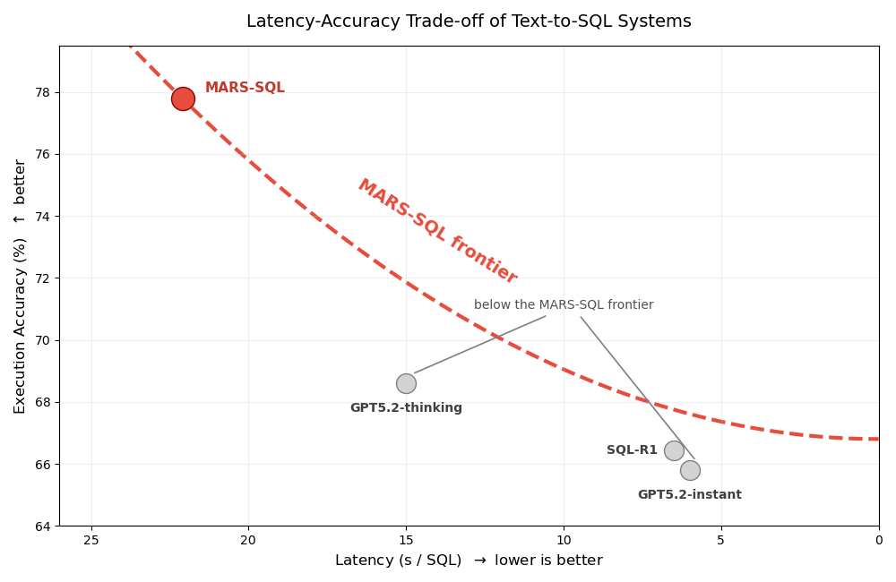

### Figure 1: MARS-SQL Pareto Efficiency

**Visual comparison of the Latency–Accuracy Pareto frontier.** This plot illustrates the trade-off between inference time (seconds per SQL) and Execution Accuracy (%). It visually confirms that **MARS-SQL (Ours)** lies on a significantly better frontier, achieving a massive **11.4% absolute accuracy gain** over SQL-R1 (with self-consistency) for moderate additional latency (~15.6 seconds). This demonstrates highly efficient scaling of test-time compute
